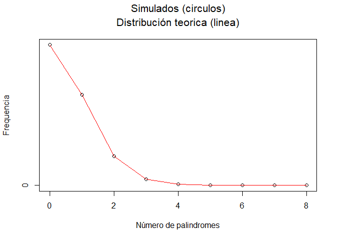
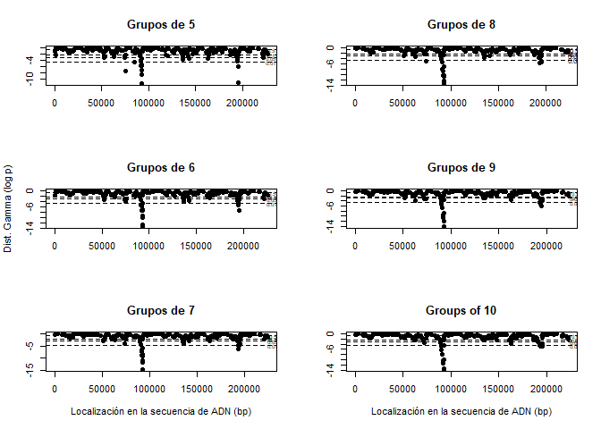
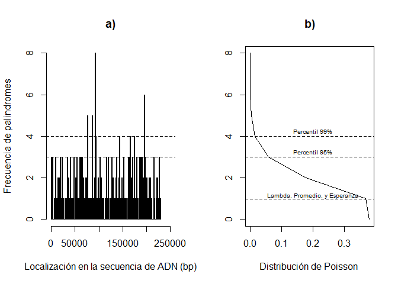
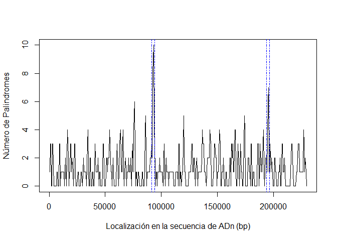

Proyecto 2. Patrones en el ADN: Identificación de sitios candidatos de
replicación de citomegalovirus (CMV) en el genoma humado usando el
proceso de Poisson.
================

Para: Pavel García Soto<br> De: Abner Herrera

Para evitar hacer una búsqueda sin dirección de los sitios de
replicación de citomegalovirus (CMV) se necesita una guía. Nolan y Speed
(2000) mencionan que el origen de replicación de dos virus de la misma
familia que el CMV se identifican por la presencia de palíndromos
complementaios, en un caso es un único palíndromo de 144 pares de bases
y en el otro, tiene varios palíndromos cortos y agrupados cerca de su
orígen de replicación. Como el palíndromo más largo en el CMV es de 18
pares de bases (Nolan y Speed, 2000). Se ha tomado la presencia de
varios palíndromos agrupados como criterio de búsqueda del origen de
replicación del CMV.

Se recomienda hacer la búsqueda en dos sitios, a) 91500 a 94000 y b)
194000 a 196500. Para reducir los intervalos de búsqueda, se utilizó el
proceso de Poisson, evitando así recomendar sitios con grupos de
palíndromos que pueden surgir por azar.

``` r
## Simulación

## simulación usando Poisson y Gamma
## Codigo para 10000 replicas de la simulación

## largo de adn
lengthdna <- 229354
## número de palindromes
numberpalin <- 296
## iteraciones
iterate <- 10000

#matris para guardar las simulaciones

sim <- matrix(nrow=iterate, ncol=numberpalin)
for(i in 1:iterate){
  sim[i,] <- sample(1:lengthdna, numberpalin, replace=F)
}

# Codigo para sumar el número de conteos
breakslength <- 230001
breaksize <- 500
mybreaks <- seq(1,breakslength,breaksize)

# Matriz generada para guardar la simulación
sim.hist <-matrix(nrow=iterate, ncol=length(mybreaks)-1)
# Bucle para obtener los conteos al azar generados 

for(i in 1:iterate){
  sim.hist[i,] <- hist(sim[i,], breaks=mybreaks, right=F, plot=F)$counts
}
# Compilar los resultados de conteos en densidades de las observasiones
# Revisar la ayuda para el comando (table)  and probar  table(sample(2:11, 1000, replace=T))
sim.dens<-table(sim.hist)/(nrow(sim.hist)*ncol(sim.hist))

# codigo para resumir las distancias entre los datos de las octetas 
distances<-apply(sim, 1, function(x){diff(sort(x), lag=7)})

# Análisis de los datos simulados y analisis de las probabilidades
## Conteos
## Grafica
plot(as.numeric(names(sim.dens)), sim.dens, ylab="Frequencia", xlab="Número de palindromes")
mtext(side=3, line=2.7, "Simulados (circulos)", cex=1.3)
mtext(side=3, line=1.2, "Distribución teorica (linea)", cex=1.3)
lines(as.numeric(names(sim.dens)), dpois(0:(length(sim.dens)-1),
                                         lambda=(numberpalin*breaksize)/lengthdna ), col="red")
```

<!-- -->

Figura 1. Comparación entre los datos simulados aleatoriamente para la
simulación 1000 repeticiones de 296 palíndromos en 229354 posiciones
(puntos), y la distribución de Poisson (línea roja). Dado que coinciden,
se puede utilizar estos datos simulados para contrastarlos contra los
datos de los palíndromos identificados en el genoma del CMV.

``` r
# Cargar los datos de palindromos en CMV, sustituyendo uno de los datos de la simulación
real_data <- read.csv("cmv.csv")
cmv <- real_data$location

#### Analizar la distribución de palindromes por secciones de adn
## Aquí s importante analizar la acumulación de palindromes (lag) en el espacio del adn
## Entonces para esto usaremos la distribución gamma.
## la distribución gamma requiere dos momementos, llamados shape (alfa) y rate (beta).
## También analizaremos la acumulación de palindromes en secciones de diferentes largos

par(mfcol = c(3, 2))

## Cada grafica tiene en el eje horizontal la localización en la secuencia de ADN en acumulaciones de palindormes de 5 a 10 palindromes
## el eje vertical tiene la distribución de probabilidad de observar el espaciamiento en estos grupos de clusters bajo una distribución gamma.
# La probabilidades estan en escala de logaritmos naturales.  

plot(cmv[1:(296-5)], pgamma(diff(cmv, lag=5), shape=5, rate=296/229354, log=T), ylab = "", xlab = "", main = "Grupos de 5", pch = 19) ## lag corresponde al número de palindromes donde se tendra la distancia del primer palindrome al ultimo palindrome del grupo. 
abline (h = c ( log(0.01), log(0.05), log(0.1), log(0.5)), lty = 2) ##  Agregar las lineas para señalar las p = 0.01, p = 0.05, p = 0.1 and p = 0.5 lty = 2 hace lineas punteads. 
text(x=c(230000,230000,230000),y=c(log(0.01), log(0.05), log(0.1),  log(0.5)),labels=c("0.01","0.05","0.1", "0.5"),cex=.6) ## Agregar etiquetas a las lineas

plot(cmv[1:(296-6)], pgamma(diff(cmv, lag=6), shape=6, rate=296/229354, log=T), ylab = "Dist. Gamma (log p)", xlab = "", main = "Grupos de 6", pch = 19)
abline (h = c ( log(0.01), log(0.05), log(0.1), log(0.5)), lty = 2)    
text(x=c(230000,230000,230000),y=c(log(0.01), log(0.05), log(0.1), log(0.5)),labels=c("0.01","0.05","0.1", "0.5"),cex=.6) 

plot(cmv[1:(296-7)], pgamma(diff(cmv, lag=7), shape=7, rate=296/229354, log=T), ylab = "", xlab = "Localización en la secuencia de ADN (bp)", main = "Grupos de 7", pch = 19)
abline (h = c ( log(0.01), log(0.05), log(0.1), log(0.5)), lty = 2)   ## Adding lines which is pointing out where p = 0.01, p = 0.05, p = 0.1 and p = 0.5 lty = 2 makes a dashed line. 
text(x=c(230000,230000,230000),y=c(log(0.01), log(0.05), log(0.1), log(0.5)),labels=c("0.01","0.05","0.1", "0.5"),cex=.6) ## adding labels for cutting lines

plot(cmv[1:(296-8)], pgamma(diff(cmv, lag=8), shape=8, rate=296/229354, log=T), ylab = "", xlab = "", main = "Grupos de 8", pch = 19)
abline (h = c ( log(0.01), log(0.05), log(0.1), log(0.5)), lty = 2)   ## Adding lines which is pointing out where p = 0.01, p = 0.05, p = 0.1 and p = 0.5 lty = 2 makes a dashed line. 
text(x=c(230000,230000,230000),y=c(log(0.01), log(0.05), log(0.1), log(0.5)),labels=c("0.01","0.05","0.1", "0.5"),cex=.8) ## adding labels for cutting lines

plot(cmv[1:(296-9)], pgamma(diff(cmv, lag=9), shape=9, rate=296/229354, log=T), ylab = "", xlab = "", main = "Grupos de 9", pch = 19)
abline (h = c ( log(0.01), log(0.05), log(0.1), log(0.5)), lty = 2)   ## Adding lines which is pointing out where p = 0.01, p = 0.05, p = 0.1 and p = 0.5 lty = 2 makes a dashed line. 
text(x=c(230000,230000,230000),y=c(log(0.01), log(0.05), log(0.1), log(0.5)),labels=c("0.01","0.05","0.1", "0.5"),cex=.6) ## adding labels for cutting lines

plot(cmv[1:(296-10)], pgamma(diff(cmv, lag=10), shape=10, rate=296/229354, log=T), ylab = "", xlab = "Localización en la secuencia de ADN (bp)", main = "Groups of 10", pch = 19)
abline (h = c ( log(0.01), log(0.05), log(0.1), log(0.5)), lty = 2)   ## Adding lines which is pointing out where p = 0.01, p = 0.05, p = 0.1 and p = 0.5 lty = 2 makes a dashed line. 
text(x=c(230000,230000,230000),y=c(log(0.01), log(0.05), log(0.1), log(0.5)),labels=c("0.01","0.05","0.1", "0.5"),cex=.6) ## adding labels for cutting lines
```

<!-- -->

Figura 2. Distribución de palíndromos de distintos tamaños de grupos a
lo largo del genoma del CMV, respecto a una distribución gamma.

Se utiliza la distribución gamma porque a pesar que las posiciones son
discretas, el tamaño del genoma es lo suficientemente extenso para que
la variable se comporte similar a una forma continua en el dominio de
los reales positivos.También, se utiliza una escala logarítmica para
hacer visibles las diferencias y visualizar las regiones que se
encuentran sobre el 99.9% de la distribución gamma.

Existen dos grupos que parecen no corresponder a la distribución gamma,
uno alrededor de la posición 90,000 y otro cerca de la posición 19,000.
Aunue este último es menos evidente.

``` r
##### Unimos esto con una distribución de frecuencias
par(mfrow=c(1,2))
hist750<-hist(cmv,breaks=seq(0, 230000, 750), ylim = c(0,8)
              ,col="grey", main= "a)", xlab="Localización en la secuencia de ADN (bp)", xlim=c(0,250000),ylab="Frecuencia de palindromes", cex = 0.8)
abline(h=qpois(c(0.99),lambda=((296/229354)*750)), lty=2) ## Adding dashed line to point out 99 % quantile. lty = 2 makes a dashed pattern in the line. 
abline(h=qpois(c(0.95),lambda=((296/229354)*750)), lty=2)  ## Adding dashed line to point out 95 % quantile.

expect.750<- (296/229354)*750 ## Calcular lambda esperado para intervalos de 500 pb
plot(dpois(0:8, lambda = 750*(296/229354)), 0:8, type ='l', main = "b)", ylab= "", xlab= "Distribución de Poisson ", cex = 0.8)
abline(h= expect.750, lty=2) ## Agregar linea discontinua para señalar lambda bajo una distribución de Poissson
text(0.20, 1.15,"Lambda, Promedio, y Esperanza", cex= 0.6) ## etiquetar linea.
abline(h=qpois(c(0.99), (296/229354)*750), lty=2) ## Agregar linea para señalar el cuantil 99%. lty = 2 hace que la linea sea discontinua
text(0.20,4.25,"Percentil 99%", cex = 0.6)
abline(h=qpois(c(0.95), (296/229354)*750), lty=2) ## Agregar una linea discontinua para señalar el cuantil 95% . lty = 2 hace que la linea sea discontinua
text(0.20,3.25,"Percentil 95%", cex = 0.6) 
```

<!-- -->

``` r
par(mfrow=c(1,1))
```

Figura 3. Frecuencia de palíndromos en regiones 750 pares de bases a lo
largo del genoma del CMV utilizando a una distribución gamma.

Al sustituir el eje y por la frecuencia de palíndromos se observa que
para una distribución aleatoria de palíndromos, el 95% de las ocasiones
se espera una frecuencia de 3 palíndromos o menos en un espacio de 750
pb, y de 4 palíndromos o menos para el 99% de las ocasiones. Sin embargo
hay 4 regiones donde esta frecuencia se ve superada, especialmente
alrededor de las posiciones 90,000 y 190,000.

``` r
## Función para obtener la localizacion de inicio y final de los agrupameintos de cluster bajo el tamaño de grupo (lag) debinido, con lambda y valores de p bajo una distribución Gamma
## 4 datos son requeridos en esta funcion. file = juego de datos con la localizacion de los palindromes,  lag = tamaño del grupo a calcular el distanciamiento entre palindromes, lambda = media esperada de palindromes para el intervalo de ADN, p = valores de probabilidad de interes, 
## regularmente nos interesamos en los datos que estan en la cola de la probabilidad de distribución.
# la salida es un objeto tipo dataframe.

location.gamma <- function( file, lag, lambda, p){
  location_gamma <-data.frame(index = 1:(296-lag),loc=file[1:(296-lag)],dist=diff(cmv, lag= lag), prob= pgamma(diff(file, lag= lag), shape=lag, rate = lambda, log=T))
  return (data.frame (Indice = location_gamma$index [location_gamma$prob < log(p)],
                      loc.O=location_gamma$loc [location_gamma$prob < log(p)],loc.lag= location_gamma$loc[location_gamma$prob < log(p)]+ lag,
                      p = signif (exp(location_gamma$prob[location_gamma$prob < log(p)]),3)))
}

## Sliding window analysis
##USAGE:
# cmv.counts<-slide.window(hcmv, 230000, blocksize=3000, incr=400)

slide.window<-function(seqdata, total.length, blocksize=500, incr=100){
  block.right<-seq(blocksize,total.length, by=incr)
  block.left<-block.right-blocksize+1
  block.mid<-(block.right+block.left)/2
  nblocks<-length(block.right)
  count<-numeric(nblocks)
  rate<-numeric(nblocks)
  
  for(i in 1:nblocks) {
    focal<-seqdata[seqdata>block.left[i] & seqdata < block.right[i]]
    count[i]<-length(focal)
    rate[i]<-count[i] / blocksize
  }
  data.frame(count, rate, block.left, block.mid, block.right)
}

Table3<- slide.window(cmv, 230000, blocksize=1500, incr=500) ## Saving the data.frame to get locations for the bigger peaks.
sorted_Table3 <- Table3[order(Table3$count, decreasing = TRUE), ]
sorted_Table3
```

    ##     count         rate block.left block.mid block.right
    ## 186    12 0.0080000000      92501   93250.5       94000
    ## 184    10 0.0066666667      91501   92250.5       93000
    ## 185    10 0.0066666667      92001   92750.5       93500
    ## 389     7 0.0046666667     194001  194750.5      195500
    ## 390     7 0.0046666667     194501  195250.5      196000
    ## 391     7 0.0046666667     195001  195750.5      196500
    ## 151     6 0.0040000000      75001   75750.5       76500
    ## 152     6 0.0040000000      75501   76250.5       77000
    ## 171     6 0.0040000000      85001   85750.5       86500
    ## 107     5 0.0033333333      53001   53750.5       54500
    ## 126     5 0.0033333333      62501   63250.5       64000
    ## 150     5 0.0033333333      74501   75250.5       76000
    ## 172     5 0.0033333333      85501   86250.5       87000
    ## 187     5 0.0033333333      93001   93750.5       94500
    ## 239     5 0.0033333333     119001  119750.5      120500
    ## 240     5 0.0033333333     119501  120250.5      121000
    ## 273     5 0.0033333333     136001  136750.5      137500
    ## 274     5 0.0033333333     136501  137250.5      138000
    ## 286     5 0.0033333333     142501  143250.5      144000
    ## 296     5 0.0033333333     147501  148250.5      149000
    ## 303     5 0.0033333333     151001  151750.5      152500
    ## 326     5 0.0033333333     162501  163250.5      164000
    ## 331     5 0.0033333333     165001  165750.5      166500
    ## 347     5 0.0033333333     173001  173750.5      174500
    ## 348     5 0.0033333333     173501  174250.5      175000
    ## 444     5 0.0033333333     221501  222250.5      223000
    ## 1       4 0.0026666667          1     750.5        1500
    ## 32      4 0.0026666667      15501   16250.5       17000
    ## 33      4 0.0026666667      16001   16750.5       17500
    ## 37      4 0.0026666667      18001   18750.5       19500
    ## 39      4 0.0026666667      19001   19750.5       20500
    ## 45      4 0.0026666667      22001   22750.5       23500
    ## 68      4 0.0026666667      33501   34250.5       35000
    ## 69      4 0.0026666667      34001   34750.5       35500
    ## 96      4 0.0026666667      47501   48250.5       49000
    ## 108     4 0.0026666667      53501   54250.5       55000
    ## 109     4 0.0026666667      54001   54750.5       55500
    ## 121     4 0.0026666667      60001   60750.5       61500
    ## 127     4 0.0026666667      63001   63750.5       64500
    ## 130     4 0.0026666667      64501   65250.5       66000
    ## 131     4 0.0026666667      65001   65750.5       66500
    ## 132     4 0.0026666667      65501   66250.5       67000
    ## 170     4 0.0026666667      84501   85250.5       86000
    ## 182     4 0.0026666667      90501   91250.5       92000
    ## 238     4 0.0026666667     118501  119250.5      120000
    ## 254     4 0.0026666667     126501  127250.5      128000
    ## 272     4 0.0026666667     135501  136250.5      137000
    ## 275     4 0.0026666667     137001  137750.5      138500
    ## 287     4 0.0026666667     143001  143750.5      144500
    ## 294     4 0.0026666667     146501  147250.5      148000
    ## 304     4 0.0026666667     151501  152250.5      153000
    ## 330     4 0.0026666667     164501  165250.5      166000
    ## 332     4 0.0026666667     165501  166250.5      167000
    ## 349     4 0.0026666667     174001  174750.5      175500
    ## 380     4 0.0026666667     189501  190250.5      191000
    ## 381     4 0.0026666667     190001  190750.5      191500
    ## 382     4 0.0026666667     190501  191250.5      192000
    ## 416     4 0.0026666667     207501  208250.5      209000
    ## 432     4 0.0026666667     215501  216250.5      217000
    ## 433     4 0.0026666667     216001  216750.5      217500
    ## 445     4 0.0026666667     222001  222750.5      223500
    ## 446     4 0.0026666667     222501  223250.5      224000
    ## 453     4 0.0026666667     226001  226750.5      227500
    ## 454     4 0.0026666667     226501  227250.5      228000
    ## 455     4 0.0026666667     227001  227750.5      228500
    ## 2       3 0.0020000000        501    1250.5        2000
    ## 3       3 0.0020000000       1001    1750.5        2500
    ## 5       3 0.0020000000       2001    2750.5        3500
    ## 6       3 0.0020000000       2501    3250.5        4000
    ## 7       3 0.0020000000       3001    3750.5        4500
    ## 17      3 0.0020000000       8001    8750.5        9500
    ## 18      3 0.0020000000       8501    9250.5       10000
    ## 19      3 0.0020000000       9001    9750.5       10500
    ## 38      3 0.0020000000      18501   19250.5       20000
    ## 44      3 0.0020000000      21501   22250.5       23000
    ## 46      3 0.0020000000      22501   23250.5       24000
    ## 67      3 0.0020000000      33001   33750.5       34500
    ## 81      3 0.0020000000      40001   40750.5       41500
    ## 82      3 0.0020000000      40501   41250.5       42000
    ## 83      3 0.0020000000      41001   41750.5       42500
    ## 95      3 0.0020000000      47001   47750.5       48500
    ## 97      3 0.0020000000      48001   48750.5       49500
    ## 103     3 0.0020000000      51001   51750.5       52500
    ## 105     3 0.0020000000      52001   52750.5       53500
    ## 106     3 0.0020000000      52501   53250.5       54000
    ## 120     3 0.0020000000      59501   60250.5       61000
    ## 125     3 0.0020000000      62001   62750.5       63500
    ## 128     3 0.0020000000      63501   64250.5       65000
    ## 148     3 0.0020000000      73501   74250.5       75000
    ## 149     3 0.0020000000      74001   74750.5       75500
    ## 180     3 0.0020000000      89501   90250.5       91000
    ## 181     3 0.0020000000      90001   90750.5       91500
    ## 183     3 0.0020000000      91001   91750.5       92500
    ## 188     3 0.0020000000      93501   94250.5       95000
    ## 204     3 0.0020000000     101501  102250.5      103000
    ## 205     3 0.0020000000     102001  102750.5      103500
    ## 230     3 0.0020000000     114501  115250.5      116000
    ## 231     3 0.0020000000     115001  115750.5      116500
    ## 232     3 0.0020000000     115501  116250.5      117000
    ## 241     3 0.0020000000     120001  120750.5      121500
    ## 253     3 0.0020000000     126001  126750.5      127500
    ## 255     3 0.0020000000     127001  127750.5      128500
    ## 258     3 0.0020000000     128501  129250.5      130000
    ## 271     3 0.0020000000     135001  135750.5      136500
    ## 276     3 0.0020000000     137501  138250.5      139000
    ## 282     3 0.0020000000     140501  141250.5      142000
    ## 283     3 0.0020000000     141001  141750.5      142500
    ## 284     3 0.0020000000     141501  142250.5      143000
    ## 285     3 0.0020000000     142001  142750.5      143500
    ## 288     3 0.0020000000     143501  144250.5      145000
    ## 295     3 0.0020000000     147001  147750.5      148500
    ## 305     3 0.0020000000     152001  152750.5      153500
    ## 324     3 0.0020000000     161501  162250.5      163000
    ## 325     3 0.0020000000     162001  162750.5      163500
    ## 327     3 0.0020000000     163001  163750.5      164500
    ## 328     3 0.0020000000     163501  164250.5      165000
    ## 336     3 0.0020000000     167501  168250.5      169000
    ## 337     3 0.0020000000     168001  168750.5      169500
    ## 340     3 0.0020000000     169501  170250.5      171000
    ## 341     3 0.0020000000     170001  170750.5      171500
    ## 342     3 0.0020000000     170501  171250.5      172000
    ## 356     3 0.0020000000     177501  178250.5      179000
    ## 359     3 0.0020000000     179001  179750.5      180500
    ## 360     3 0.0020000000     179501  180250.5      181000
    ## 361     3 0.0020000000     180001  180750.5      181500
    ## 371     3 0.0020000000     185001  185750.5      186500
    ## 372     3 0.0020000000     185501  186250.5      187000
    ## 373     3 0.0020000000     186001  186750.5      187500
    ## 375     3 0.0020000000     187001  187750.5      188500
    ## 376     3 0.0020000000     187501  188250.5      189000
    ## 377     3 0.0020000000     188001  188750.5      189500
    ## 386     3 0.0020000000     192501  193250.5      194000
    ## 387     3 0.0020000000     193001  193750.5      194500
    ## 393     3 0.0020000000     196001  196750.5      197500
    ## 394     3 0.0020000000     196501  197250.5      198000
    ## 395     3 0.0020000000     197001  197750.5      198500
    ## 403     3 0.0020000000     201001  201750.5      202500
    ## 414     3 0.0020000000     206501  207250.5      208000
    ## 415     3 0.0020000000     207001  207750.5      208500
    ## 431     3 0.0020000000     215001  215750.5      216500
    ## 442     3 0.0020000000     220501  221250.5      222000
    ## 443     3 0.0020000000     221001  221750.5      222500
    ## 22      2 0.0013333333      10501   11250.5       12000
    ## 24      2 0.0013333333      11501   12250.5       13000
    ## 28      2 0.0013333333      13501   14250.5       15000
    ## 29      2 0.0013333333      14001   14750.5       15500
    ## 31      2 0.0013333333      15001   15750.5       16500
    ## 34      2 0.0013333333      16501   17250.5       18000
    ## 40      2 0.0013333333      19501   20250.5       21000
    ## 41      2 0.0013333333      20001   20750.5       21500
    ## 60      2 0.0013333333      29501   30250.5       31000
    ## 61      2 0.0013333333      30001   30750.5       31500
    ## 62      2 0.0013333333      30501   31250.5       32000
    ## 64      2 0.0013333333      31501   32250.5       33000
    ## 72      2 0.0013333333      35501   36250.5       37000
    ## 73      2 0.0013333333      36001   36750.5       37500
    ## 74      2 0.0013333333      36501   37250.5       38000
    ## 85      2 0.0013333333      42001   42750.5       43500
    ## 86      2 0.0013333333      42501   43250.5       44000
    ## 87      2 0.0013333333      43001   43750.5       44500
    ## 101     2 0.0013333333      50001   50750.5       51500
    ## 102     2 0.0013333333      50501   51250.5       52000
    ## 104     2 0.0013333333      51501   52250.5       53000
    ## 113     2 0.0013333333      56001   56750.5       57500
    ## 114     2 0.0013333333      56501   57250.5       58000
    ## 119     2 0.0013333333      59001   59750.5       60500
    ## 122     2 0.0013333333      60501   61250.5       62000
    ## 135     2 0.0013333333      67001   67750.5       68500
    ## 136     2 0.0013333333      67501   68250.5       69000
    ## 140     2 0.0013333333      69501   70250.5       71000
    ## 141     2 0.0013333333      70001   70750.5       71500
    ## 142     2 0.0013333333      70501   71250.5       72000
    ## 143     2 0.0013333333      71001   71750.5       72500
    ## 144     2 0.0013333333      71501   72250.5       73000
    ## 145     2 0.0013333333      72001   72750.5       73500
    ## 147     2 0.0013333333      73001   73750.5       74500
    ## 153     2 0.0013333333      76001   76750.5       77500
    ## 173     2 0.0013333333      86001   86750.5       87500
    ## 176     2 0.0013333333      87501   88250.5       89000
    ## 178     2 0.0013333333      88501   89250.5       90000
    ## 179     2 0.0013333333      89001   89750.5       90500
    ## 195     2 0.0013333333      97001   97750.5       98500
    ## 196     2 0.0013333333      97501   98250.5       99000
    ## 197     2 0.0013333333      98001   98750.5       99500
    ## 198     2 0.0013333333      98501   99250.5      100000
    ## 200     2 0.0013333333      99501  100250.5      101000
    ## 203     2 0.0013333333     101001  101750.5      102500
    ## 208     2 0.0013333333     103501  104250.5      105000
    ## 209     2 0.0013333333     104001  104750.5      105500
    ## 210     2 0.0013333333     104501  105250.5      106000
    ## 215     2 0.0013333333     107001  107750.5      108500
    ## 217     2 0.0013333333     108001  108750.5      109500
    ## 219     2 0.0013333333     109001  109750.5      110500
    ## 227     2 0.0013333333     113001  113750.5      114500
    ## 250     2 0.0013333333     124501  125250.5      126000
    ## 252     2 0.0013333333     125501  126250.5      127000
    ## 256     2 0.0013333333     127501  128250.5      129000
    ## 257     2 0.0013333333     128001  128750.5      129500
    ## 259     2 0.0013333333     129001  129750.5      130500
    ## 262     2 0.0013333333     130501  131250.5      132000
    ## 263     2 0.0013333333     131001  131750.5      132500
    ## 267     2 0.0013333333     133001  133750.5      134500
    ## 269     2 0.0013333333     134001  134750.5      135500
    ## 277     2 0.0013333333     138001  138750.5      139500
    ## 281     2 0.0013333333     140001  140750.5      141500
    ## 297     2 0.0013333333     148001  148750.5      149500
    ## 298     2 0.0013333333     148501  149250.5      150000
    ## 301     2 0.0013333333     150001  150750.5      151500
    ## 302     2 0.0013333333     150501  151250.5      152000
    ## 309     2 0.0013333333     154001  154750.5      155500
    ## 310     2 0.0013333333     154501  155250.5      156000
    ## 311     2 0.0013333333     155001  155750.5      156500
    ## 321     2 0.0013333333     160001  160750.5      161500
    ## 322     2 0.0013333333     160501  161250.5      162000
    ## 323     2 0.0013333333     161001  161750.5      162500
    ## 329     2 0.0013333333     164001  164750.5      165500
    ## 338     2 0.0013333333     168501  169250.5      170000
    ## 354     2 0.0013333333     176501  177250.5      178000
    ## 355     2 0.0013333333     177001  177750.5      178500
    ## 378     2 0.0013333333     188501  189250.5      190000
    ## 379     2 0.0013333333     189001  189750.5      190500
    ## 385     2 0.0013333333     192001  192750.5      193500
    ## 388     2 0.0013333333     193501  194250.5      195000
    ## 392     2 0.0013333333     195501  196250.5      197000
    ## 396     2 0.0013333333     197501  198250.5      199000
    ## 397     2 0.0013333333     198001  198750.5      199500
    ## 401     2 0.0013333333     200001  200750.5      201500
    ## 402     2 0.0013333333     200501  201250.5      202000
    ## 410     2 0.0013333333     204501  205250.5      206000
    ## 411     2 0.0013333333     205001  205750.5      206500
    ## 412     2 0.0013333333     205501  206250.5      207000
    ## 418     2 0.0013333333     208501  209250.5      210000
    ## 419     2 0.0013333333     209001  209750.5      210500
    ## 420     2 0.0013333333     209501  210250.5      211000
    ## 434     2 0.0013333333     216501  217250.5      218000
    ## 448     2 0.0013333333     223501  224250.5      225000
    ## 450     2 0.0013333333     224501  225250.5      226000
    ## 452     2 0.0013333333     225501  226250.5      227000
    ## 456     2 0.0013333333     227501  228250.5      229000
    ## 457     2 0.0013333333     228001  228750.5      229500
    ## 13      1 0.0006666667       6001    6750.5        7500
    ## 14      1 0.0006666667       6501    7250.5        8000
    ## 15      1 0.0006666667       7001    7750.5        8500
    ## 20      1 0.0006666667       9501   10250.5       11000
    ## 21      1 0.0006666667      10001   10750.5       11500
    ## 23      1 0.0006666667      11001   11750.5       12500
    ## 25      1 0.0006666667      12001   12750.5       13500
    ## 26      1 0.0006666667      12501   13250.5       14000
    ## 27      1 0.0006666667      13001   13750.5       14500
    ## 30      1 0.0006666667      14501   15250.5       16000
    ## 35      1 0.0006666667      17001   17750.5       18500
    ## 36      1 0.0006666667      17501   18250.5       19000
    ## 42      1 0.0006666667      20501   21250.5       22000
    ## 43      1 0.0006666667      21001   21750.5       22500
    ## 47      1 0.0006666667      23001   23750.5       24500
    ## 50      1 0.0006666667      24501   25250.5       26000
    ## 51      1 0.0006666667      25001   25750.5       26500
    ## 52      1 0.0006666667      25501   26250.5       27000
    ## 56      1 0.0006666667      27501   28250.5       29000
    ## 57      1 0.0006666667      28001   28750.5       29500
    ## 58      1 0.0006666667      28501   29250.5       30000
    ## 59      1 0.0006666667      29001   29750.5       30500
    ## 63      1 0.0006666667      31001   31750.5       32500
    ## 65      1 0.0006666667      32001   32750.5       33500
    ## 66      1 0.0006666667      32501   33250.5       34000
    ## 70      1 0.0006666667      34501   35250.5       36000
    ## 76      1 0.0006666667      37501   38250.5       39000
    ## 77      1 0.0006666667      38001   38750.5       39500
    ## 78      1 0.0006666667      38501   39250.5       40000
    ## 80      1 0.0006666667      39501   40250.5       41000
    ## 84      1 0.0006666667      41501   42250.5       43000
    ## 88      1 0.0006666667      43501   44250.5       45000
    ## 89      1 0.0006666667      44001   44750.5       45500
    ## 90      1 0.0006666667      44501   45250.5       46000
    ## 91      1 0.0006666667      45001   45750.5       46500
    ## 94      1 0.0006666667      46501   47250.5       48000
    ## 98      1 0.0006666667      48501   49250.5       50000
    ## 110     1 0.0006666667      54501   55250.5       56000
    ## 111     1 0.0006666667      55001   55750.5       56500
    ## 112     1 0.0006666667      55501   56250.5       57000
    ## 115     1 0.0006666667      57001   57750.5       58500
    ## 123     1 0.0006666667      61001   61750.5       62500
    ## 124     1 0.0006666667      61501   62250.5       63000
    ## 129     1 0.0006666667      64001   64750.5       65500
    ## 133     1 0.0006666667      66001   66750.5       67500
    ## 134     1 0.0006666667      66501   67250.5       68000
    ## 137     1 0.0006666667      68001   68750.5       69500
    ## 138     1 0.0006666667      68501   69250.5       70000
    ## 139     1 0.0006666667      69001   69750.5       70500
    ## 146     1 0.0006666667      72501   73250.5       74000
    ## 154     1 0.0006666667      76501   77250.5       78000
    ## 155     1 0.0006666667      77001   77750.5       78500
    ## 156     1 0.0006666667      77501   78250.5       79000
    ## 158     1 0.0006666667      78501   79250.5       80000
    ## 159     1 0.0006666667      79001   79750.5       80500
    ## 160     1 0.0006666667      79501   80250.5       81000
    ## 165     1 0.0006666667      82001   82750.5       83500
    ## 166     1 0.0006666667      82501   83250.5       84000
    ## 167     1 0.0006666667      83001   83750.5       84500
    ## 169     1 0.0006666667      84001   84750.5       85500
    ## 174     1 0.0006666667      86501   87250.5       88000
    ## 175     1 0.0006666667      87001   87750.5       88500
    ## 177     1 0.0006666667      88001   88750.5       89500
    ## 189     1 0.0006666667      94001   94750.5       95500
    ## 190     1 0.0006666667      94501   95250.5       96000
    ## 191     1 0.0006666667      95001   95750.5       96500
    ## 192     1 0.0006666667      95501   96250.5       97000
    ## 193     1 0.0006666667      96001   96750.5       97500
    ## 194     1 0.0006666667      96501   97250.5       98000
    ## 199     1 0.0006666667      99001   99750.5      100500
    ## 201     1 0.0006666667     100001  100750.5      101500
    ## 202     1 0.0006666667     100501  101250.5      102000
    ## 206     1 0.0006666667     102501  103250.5      104000
    ## 207     1 0.0006666667     103001  103750.5      104500
    ## 211     1 0.0006666667     105001  105750.5      106500
    ## 212     1 0.0006666667     105501  106250.5      107000
    ## 213     1 0.0006666667     106001  106750.5      107500
    ## 214     1 0.0006666667     106501  107250.5      108000
    ## 216     1 0.0006666667     107501  108250.5      109000
    ## 218     1 0.0006666667     108501  109250.5      110000
    ## 220     1 0.0006666667     109501  110250.5      111000
    ## 221     1 0.0006666667     110001  110750.5      111500
    ## 225     1 0.0006666667     112001  112750.5      113500
    ## 226     1 0.0006666667     112501  113250.5      114000
    ## 228     1 0.0006666667     113501  114250.5      115000
    ## 229     1 0.0006666667     114001  114750.5      115500
    ## 233     1 0.0006666667     116001  116750.5      117500
    ## 234     1 0.0006666667     116501  117250.5      118000
    ## 235     1 0.0006666667     117001  117750.5      118500
    ## 236     1 0.0006666667     117501  118250.5      119000
    ## 237     1 0.0006666667     118001  118750.5      119500
    ## 242     1 0.0006666667     120501  121250.5      122000
    ## 243     1 0.0006666667     121001  121750.5      122500
    ## 248     1 0.0006666667     123501  124250.5      125000
    ## 249     1 0.0006666667     124001  124750.5      125500
    ## 251     1 0.0006666667     125001  125750.5      126500
    ## 260     1 0.0006666667     129501  130250.5      131000
    ## 261     1 0.0006666667     130001  130750.5      131500
    ## 264     1 0.0006666667     131501  132250.5      133000
    ## 265     1 0.0006666667     132001  132750.5      133500
    ## 266     1 0.0006666667     132501  133250.5      134000
    ## 268     1 0.0006666667     133501  134250.5      135000
    ## 270     1 0.0006666667     134501  135250.5      136000
    ## 278     1 0.0006666667     138501  139250.5      140000
    ## 279     1 0.0006666667     139001  139750.5      140500
    ## 280     1 0.0006666667     139501  140250.5      141000
    ## 292     1 0.0006666667     145501  146250.5      147000
    ## 293     1 0.0006666667     146001  146750.5      147500
    ## 299     1 0.0006666667     149001  149750.5      150500
    ## 300     1 0.0006666667     149501  150250.5      151000
    ## 307     1 0.0006666667     153001  153750.5      154500
    ## 308     1 0.0006666667     153501  154250.5      155000
    ## 312     1 0.0006666667     155501  156250.5      157000
    ## 314     1 0.0006666667     156501  157250.5      158000
    ## 315     1 0.0006666667     157001  157750.5      158500
    ## 316     1 0.0006666667     157501  158250.5      159000
    ## 333     1 0.0006666667     166001  166750.5      167500
    ## 335     1 0.0006666667     167001  167750.5      168500
    ## 339     1 0.0006666667     169001  169750.5      170500
    ## 343     1 0.0006666667     171001  171750.5      172500
    ## 344     1 0.0006666667     171501  172250.5      173000
    ## 346     1 0.0006666667     172501  173250.5      174000
    ## 357     1 0.0006666667     178001  178750.5      179500
    ## 358     1 0.0006666667     178501  179250.5      180000
    ## 363     1 0.0006666667     181001  181750.5      182500
    ## 364     1 0.0006666667     181501  182250.5      183000
    ## 365     1 0.0006666667     182001  182750.5      183500
    ## 374     1 0.0006666667     186501  187250.5      188000
    ## 383     1 0.0006666667     191001  191750.5      192500
    ## 384     1 0.0006666667     191501  192250.5      193000
    ## 398     1 0.0006666667     198501  199250.5      200000
    ## 404     1 0.0006666667     201501  202250.5      203000
    ## 405     1 0.0006666667     202001  202750.5      203500
    ## 408     1 0.0006666667     203501  204250.5      205000
    ## 409     1 0.0006666667     204001  204750.5      205500
    ## 417     1 0.0006666667     208001  208750.5      209500
    ## 421     1 0.0006666667     210001  210750.5      211500
    ## 430     1 0.0006666667     214501  215250.5      216000
    ## 435     1 0.0006666667     217001  217750.5      218500
    ## 440     1 0.0006666667     219501  220250.5      221000
    ## 441     1 0.0006666667     220001  220750.5      221500
    ## 447     1 0.0006666667     223001  223750.5      224500
    ## 449     1 0.0006666667     224001  224750.5      225500
    ## 451     1 0.0006666667     225001  225750.5      226500
    ## 458     1 0.0006666667     228501  229250.5      230000
    ## 4       0 0.0000000000       1501    2250.5        3000
    ## 8       0 0.0000000000       3501    4250.5        5000
    ## 9       0 0.0000000000       4001    4750.5        5500
    ## 10      0 0.0000000000       4501    5250.5        6000
    ## 11      0 0.0000000000       5001    5750.5        6500
    ## 12      0 0.0000000000       5501    6250.5        7000
    ## 16      0 0.0000000000       7501    8250.5        9000
    ## 48      0 0.0000000000      23501   24250.5       25000
    ## 49      0 0.0000000000      24001   24750.5       25500
    ## 53      0 0.0000000000      26001   26750.5       27500
    ## 54      0 0.0000000000      26501   27250.5       28000
    ## 55      0 0.0000000000      27001   27750.5       28500
    ## 71      0 0.0000000000      35001   35750.5       36500
    ## 75      0 0.0000000000      37001   37750.5       38500
    ## 79      0 0.0000000000      39001   39750.5       40500
    ## 92      0 0.0000000000      45501   46250.5       47000
    ## 93      0 0.0000000000      46001   46750.5       47500
    ## 99      0 0.0000000000      49001   49750.5       50500
    ## 100     0 0.0000000000      49501   50250.5       51000
    ## 116     0 0.0000000000      57501   58250.5       59000
    ## 117     0 0.0000000000      58001   58750.5       59500
    ## 118     0 0.0000000000      58501   59250.5       60000
    ## 157     0 0.0000000000      78001   78750.5       79500
    ## 161     0 0.0000000000      80001   80750.5       81500
    ## 162     0 0.0000000000      80501   81250.5       82000
    ## 163     0 0.0000000000      81001   81750.5       82500
    ## 164     0 0.0000000000      81501   82250.5       83000
    ## 168     0 0.0000000000      83501   84250.5       85000
    ## 222     0 0.0000000000     110501  111250.5      112000
    ## 223     0 0.0000000000     111001  111750.5      112500
    ## 224     0 0.0000000000     111501  112250.5      113000
    ## 244     0 0.0000000000     121501  122250.5      123000
    ## 245     0 0.0000000000     122001  122750.5      123500
    ## 246     0 0.0000000000     122501  123250.5      124000
    ## 247     0 0.0000000000     123001  123750.5      124500
    ## 289     0 0.0000000000     144001  144750.5      145500
    ## 290     0 0.0000000000     144501  145250.5      146000
    ## 291     0 0.0000000000     145001  145750.5      146500
    ## 306     0 0.0000000000     152501  153250.5      154000
    ## 313     0 0.0000000000     156001  156750.5      157500
    ## 317     0 0.0000000000     158001  158750.5      159500
    ## 318     0 0.0000000000     158501  159250.5      160000
    ## 319     0 0.0000000000     159001  159750.5      160500
    ## 320     0 0.0000000000     159501  160250.5      161000
    ## 334     0 0.0000000000     166501  167250.5      168000
    ## 345     0 0.0000000000     172001  172750.5      173500
    ## 350     0 0.0000000000     174501  175250.5      176000
    ## 351     0 0.0000000000     175001  175750.5      176500
    ## 352     0 0.0000000000     175501  176250.5      177000
    ## 353     0 0.0000000000     176001  176750.5      177500
    ## 362     0 0.0000000000     180501  181250.5      182000
    ## 366     0 0.0000000000     182501  183250.5      184000
    ## 367     0 0.0000000000     183001  183750.5      184500
    ## 368     0 0.0000000000     183501  184250.5      185000
    ## 369     0 0.0000000000     184001  184750.5      185500
    ## 370     0 0.0000000000     184501  185250.5      186000
    ## 399     0 0.0000000000     199001  199750.5      200500
    ## 400     0 0.0000000000     199501  200250.5      201000
    ## 406     0 0.0000000000     202501  203250.5      204000
    ## 407     0 0.0000000000     203001  203750.5      204500
    ## 413     0 0.0000000000     206001  206750.5      207500
    ## 422     0 0.0000000000     210501  211250.5      212000
    ## 423     0 0.0000000000     211001  211750.5      212500
    ## 424     0 0.0000000000     211501  212250.5      213000
    ## 425     0 0.0000000000     212001  212750.5      213500
    ## 426     0 0.0000000000     212501  213250.5      214000
    ## 427     0 0.0000000000     213001  213750.5      214500
    ## 428     0 0.0000000000     213501  214250.5      215000
    ## 429     0 0.0000000000     214001  214750.5      215500
    ## 436     0 0.0000000000     217501  218250.5      219000
    ## 437     0 0.0000000000     218001  218750.5      219500
    ## 438     0 0.0000000000     218501  219250.5      220000
    ## 439     0 0.0000000000     219001  219750.5      220500

Tabla 1. Bloques de 1500 pb con la mayor frecuencia de palíndromos.

Utilizando un algoritmo de ventana deslizando se afinó la identificación
de los sitios con mayor número de palíndromos. Las primeras 3 líneas de
la tabla 1 corresponden al sitio que más se aleja de la distribución
gamma, se tomaron el límite inferior y superior para establecer la
primer región de búsqueda: 91500 a 94000. De igual manera con las
siguientes tres líneas para la segunda región de búsqueda: 194000 a
196500.

``` r
# plot(count ~ block.mid, data=cmv.counts, type="l")
plot(count ~ block.mid, data=slide.window(cmv, 230000, blocksize=1000, incr=500), type="l", xlab="Localización en la secuencia de ADn (bp)", ylab = "Número de Palindromes")
abline (v = 91500, lty = 10, col= "blue") ## adding a line to mark the starting location in the first recomeded section to search for replication site. 
abline (v = 94000, lty = 10, col = "blue") ## adding a line to mark the ending location in the first recomeded section to search for replication site.
abline (v = 194000, lty = 10, col = "blue") ## adding a line to mark the starting location in the second recomeded section to search for replication site.
abline (v = 196500, lty = 10, col = "blue") ## adding a line to mark the starting location in the second recomeded section to search for replication site.
```

<!-- -->

Figura 4. Sitios recomendados para Identificación de sitios candidatos
de replicación de CMV en el genoma humano.

Los picos más altos muestran la misma información que la tabla 1 de
manera gráfica. Existen otros dos picos que son candidatos por estar
fuera del 99% de la distribución gamma, sin embargo el primer sitio
recomendado es el candidato más adecuado dado que supera por 4 unidades
de frecuencia el límite del 99% (figura 3).
