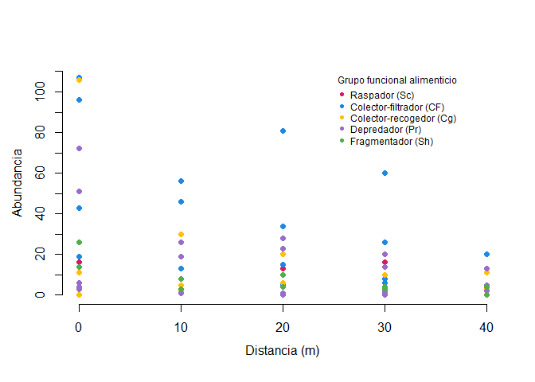
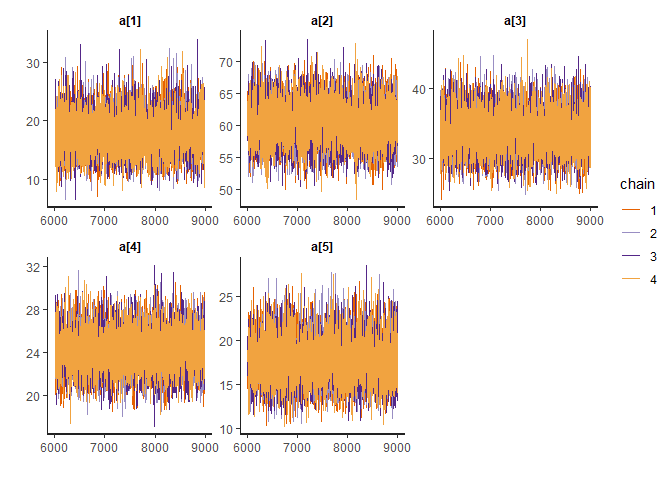
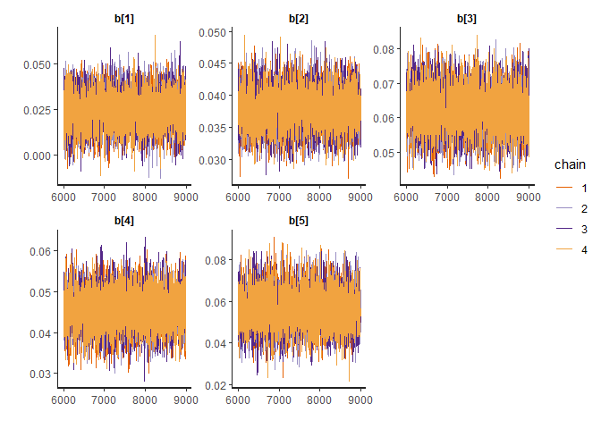
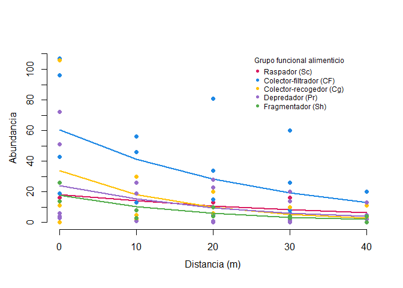

Proyecto 3. Dispersión lateral de insectos acuáticos del orden
Trichoptera en un arroyo de la Mata Atlantica en Brasil
================

Para: Pavel García Soto<br> De: Abner Herrera

Los datos proporcionados en la investigación de Pereira et al. (2024)
muestran que los insectos acuáticos fragmentadores de hojarasca del
orden Trichoptera tienen menor capacidad de dispersión, desde una fuente
de agua, respecto a otros grupos funcionales como los raspadores,
Colectores-filtradores y Depredadores. Con excepción de los
Colectores-recogedores, que presentan la menor tasa de dispersión entre
todos los grupos mencionados. Por lo tanto, aún no se puede concluir que
os insectos acuáticos fragmentadores de hojarasca poseen la menor
capacidad de dispersión.

Para este ejercicio se utilizó un modelo jerárquico de dos niveles. El
primero representa el orden Trichoptera, que agrupa todos los datos, y
el segundo nivel es representado por los distintos grupos funcionales
alimenticios de estos insectos acuáticos (Fig 1). El modelo utilizado es
uno exponencial de decaimiento bajo una distribución de poisson.

La estimación de los parámetros a y b se realizó mediante la regla de
Bayes.

Se encontró que en promedio, los insectos acuáticos del orden
Trichoptera se desplazan en promedio 22.26m desde la fuente de agua.
Entre los grupos funcionales, los que se desplazan más son los
Raspadores (39.30m) y los que se desplazan menos son los
colectores-recogedores (16.11m).

``` r
## cargar paquetes
library (rstan)
```

    ## Cargando paquete requerido: StanHeaders

    ## 
    ## rstan version 2.32.7 (Stan version 2.32.2)

    ## For execution on a local, multicore CPU with excess RAM we recommend calling
    ## options(mc.cores = parallel::detectCores()).
    ## To avoid recompilation of unchanged Stan programs, we recommend calling
    ## rstan_options(auto_write = TRUE)
    ## For within-chain threading using `reduce_sum()` or `map_rect()` Stan functions,
    ## change `threads_per_chain` option:
    ## rstan_options(threads_per_chain = 1)

    ## Do not specify '-march=native' in 'LOCAL_CPPFLAGS' or a Makevars file

``` r
rstan_options(auto_write = TRUE)
options(mc.cores = parallel::detectCores())
rstan_options(threads_per_chain = 1)
library (tidybayes)

# Data
datos <- read.csv("datos.csv", skip=4)

## Convertir FFG a enteros, esto es util para hacer el análisis bayesiano posteriormente y se aprovecha de una vez para generar el primer gráfico de distribución por grupos funcionales.
## Sc= 1, CF= 2, Cg = 3, Pr = 4, Sh = 5
datos$F_no <- ifelse(datos$FFG == "Sc", 1,
                     ifelse(datos$FFG == "CF", 2,
                            ifelse(datos$FFG == "Cg", 3,
                                   ifelse(datos$FFG == "Pr", 4,
                                          ifelse(datos$FFG == "Sh", 5, NA)))))

## Primer gráfico
frame();
plot.window(xlim=c(0, 40), ylim=c(0,110));

axis(side=1, at=seq(0, 40, by = 10), cex.axis=1);
axis(side=2, at=seq(0, 110, by= 10), cex.axis = 1);

mtext("Abundancia", side = 2,line=2.5, cex=1);
mtext("Distancia (m)",side=1,cex=1, line = 2.5);

# Los puntos de dispersión de los cinco grupos funcionales
points (datos$Distancia_m[datos$F_no == 1], datos$Abundancia[datos$F_no == 1], col= "#D81B60", pch= 16)
points (datos$Distancia_m[datos$F_no == 2], datos$Abundancia[datos$F_no == 2], col= "#1E88E5", pch= 16)
points (datos$Distancia_m[datos$F_no == 3], datos$Abundancia[datos$F_no == 3], col= "#FFC107", pch= 16)
points (datos$Distancia_m[datos$F_no == 4], datos$Abundancia[datos$F_no == 4], col= "#986cca", pch= 16)
points (datos$Distancia_m[datos$F_no == 5], datos$Abundancia[datos$F_no == 5], col= "#54ad4d", pch= 16)

# Leyenda
legend(25,110, col = c("#D81B60","#1E88E5","#FFC107","#986cca","#54ad4d"), title ="Grupo funcional alimenticio",
       legend = c("Raspador (Sc)",  "Colector-filtrador (CF)", "Colector-recogedor (Cg)","Depredador (Pr)","Fragmentador (Sh)"), bty ="n",
       pch = c(16,16,16,16,16), cex= 0.75)
```

<!-- --> Figura 1.
Relación distancia en m a la fuente de agua y abundancia de insectos
acúaticos.

``` r
## Codigo en el lenguage de stan para generar el modelo bayesiano jerárquico
sink("poisson2.stan")
cat("
    data {
    
    int <lower=1> N; // numero de puntos
    int <lower=0> A[N]; // Abundancia (variable respuesta)
    vector [N] D; // Distancia en donde fue muestreado (variable independiente)
    int  <lower=1> FF[N]; //FFG, grupos funcionales
    int  <lower=1> F_no; // Número de grupos funcionales
    }
    
    parameters {
    vector [F_no] a;
    real <lower=0> sigma_a;
    real mu_a;
    
    vector [F_no] b;
    real mu_b;    
    real sigma_b;
    }
    
    model {
    //priors del intercepto, no son informativos
    mu_a ~ normal(45,50);
    sigma_a ~ normal(0,10);
    a ~ normal(mu_a, sigma_a);
    
    //priors de la pendiente, no son informativos
    mu_b ~ normal(0,0.1);
    sigma_b ~ normal(0,0.1);
    b ~ normal(mu_b, sigma_b);

    //likelihood
    for(i in 1:N){
    A[i] ~ poisson(a[FF[i]]*exp(-b[FF[i]]*D[i])); // el modelo es y = a * exp(-b * x)
    }
    }
    
    "
    ,fill=TRUE)
sink()

## hacer una lista
abund_data <- list(A=datos$Abundancia, D=datos$Distancia_m, N=length(datos$Distancia_m), FF=datos$F_no, F_no=5)

## correr modelo
abund_fit2<-stan(file='poisson2.stan', data = abund_data, 
                 iter = 9000, chains = 4, warmup = 6000)
```

    ## Warning: There were 393 divergent transitions after warmup. See
    ## https://mc-stan.org/misc/warnings.html#divergent-transitions-after-warmup
    ## to find out why this is a problem and how to eliminate them.

    ## Warning: Examine the pairs() plot to diagnose sampling problems

Cuadro 1. Valores promedio e intervalos de credibilidad para el
intercepto (a) y pendiente (b) por grupo funcional alimenticio en la
ecuación Abundancia = a \* exp(-b \* Distancia).

``` r
print(abund_fit2, digits_summary = 6)
```

    ## Inference for Stan model: anon_model.
    ## 4 chains, each with iter=9000; warmup=6000; thin=1; 
    ## post-warmup draws per chain=3000, total post-warmup draws=12000.
    ## 
    ##                mean  se_mean       sd        2.5%         25%         50%
    ## a[1]      18.173810 0.050903 3.505640   11.829253   15.703111   18.025177
    ## a[2]      60.405618 0.043701 3.263245   54.278360   58.160783   60.336894
    ## a[3]      33.739319 0.040920 2.993527   28.205917   31.660852   33.632509
    ## a[4]      24.193175 0.023520 1.900483   20.578518   22.889356   24.169920
    ## a[5]      17.744865 0.032490 2.558625   13.146249   15.942831   17.644766
    ## sigma_a   16.129038 0.051711 4.156603    9.725348   13.119355   15.598347
    ## mu_a      31.080309 0.088244 7.243255   16.685357   26.483509   31.100708
    ## b[1]       0.025551 0.000143 0.009724    0.006125    0.019026    0.025748
    ## b[2]       0.037979 0.000038 0.002987    0.032031    0.035966    0.037983
    ## b[3]       0.061936 0.000089 0.006159    0.049975    0.057690    0.061914
    ## b[4]       0.045596 0.000056 0.004540    0.036753    0.042508    0.045565
    ## b[5]       0.055772 0.000118 0.008899    0.039285    0.049664    0.055529
    ## mu_b       0.044564 0.000175 0.012388    0.019311    0.038595    0.044882
    ## sigma_b    0.023174 0.000283 0.014198    0.007266    0.014021    0.019543
    ## lp__    2796.292754 0.051384 2.994295 2789.496846 2794.514416 2796.655691
    ##                 75%       97.5% n_eff     Rhat
    ## a[1]      20.478255   25.337060  4743 1.000007
    ## a[2]      62.594835   67.025141  5576 1.000385
    ## a[3]      35.743384   39.953247  5352 1.000037
    ## a[4]      25.441519   28.030234  6529 1.000319
    ## a[5]      19.415378   23.132826  6202 1.000249
    ## sigma_a   18.489324   25.699936  6461 1.000562
    ## mu_a      35.656302   45.585026  6737 1.000188
    ## b[1]       0.032374    0.043912  4605 1.000192
    ## b[2]       0.040015    0.043791  6040 1.000230
    ## b[3]       0.066019    0.074500  4768 1.000191
    ## b[4]       0.048663    0.054511  6648 1.000335
    ## b[5]       0.061572    0.073821  5694 1.000679
    ## mu_b       0.051115    0.068910  5004 1.000337
    ## sigma_b    0.027892    0.062650  2514 1.001024
    ## lp__    2798.459645 2801.056072  3396 1.000759
    ## 
    ## Samples were drawn using NUTS(diag_e) at Sun Jun  1 12:13:08 2025.
    ## For each parameter, n_eff is a crude measure of effective sample size,
    ## and Rhat is the potential scale reduction factor on split chains (at 
    ## convergence, Rhat=1).

``` r
## revisar la convergencia de las cadenas
traceplot(abund_fit2, pars = c("a"))
```

<!-- -->

``` r
traceplot(abund_fit2, pars = c("b"))
```

<!-- --> Figura 2.
Evaluación de la convergencia y mezcla del modelo de poder para la
relación de la Abundancia (A) y la distancia a la fuente de agua en m
(D).

Cuadro 2. Valores estimados de los interceptos (a) y pendientes (b) con
sus intervalos de credibilidad bayesiano, ordenados de mayor a menor
valor absoluto incluyendo el valor medio (primer nivel jerárquico).

``` r
## Tabla de los interceptos (a) y pendientes (b) con sus intervalos de credibilidad bayesiano
modelo <- extract(abund_fit2)
#modelo

Sc <-data.frame (c(mean_a = mean(modelo$a[,1]), CI = quantile(modelo$a[,1], probs =c(0.025,0.975)), mean_b = mean(modelo$b[,1]), CI = quantile(modelo$b[,1], probs =c(0.025,0.975))))
row.names(Sc)<- c("a_estimado", "a_CI_2.5%", "a_CI_97.5%", 
                       "b_estimado", "b_CI_2.5%", "b_CI_97.5%" )
colnames(Sc)<- c("Sc")

CF <-data.frame (c(mean_a = mean(modelo$a[,2]), CI = quantile(modelo$a[,2], probs =c(0.025,0.975)), mean_b = mean(modelo$b[,2]), CI = quantile(modelo$b[,2], probs =c(0.025,0.975))))
row.names(CF)<- c("a_estimado", "a_CI_2.5%", "a_CI_97.5%", 
                       "b_estimado", "b_CI_2.5%", "b_CI_97.5%" )
colnames(CF)<- c("CF")

Cg <-data.frame (c(mean_a = mean(modelo$a[,3]), CI = quantile(modelo$a[,3], probs =c(0.025,0.975)), mean_b = mean(modelo$b[,3]), CI = quantile(modelo$b[,3], probs =c(0.025,0.975))))
row.names(Cg)<- c("a_estimado", "a_CI_2.5%", "a_CI_97.5%", 
                       "b_estimado", "b_CI_2.5%", "b_CI_97.5%" )
colnames(Cg)<- c("Cg")

Pr <-data.frame (c(mean_a = mean(modelo$a[,4]), CI = quantile(modelo$a[,4], probs =c(0.025,0.975)), mean_b = mean(modelo$b[,4]), CI = quantile(modelo$b[,4], probs =c(0.025,0.975))))
row.names(Pr)<- c("a_estimado", "a_CI_2.5%", "a_CI_97.5%", 
                       "b_estimado", "b_CI_2.5%", "b_CI_97.5%" )
colnames(Pr)<- c("Pr")

Sh <-data.frame (c(mean_a = mean(modelo$a[,5]), CI = quantile(modelo$a[,5], probs =c(0.025,0.975)), mean_b = mean(modelo$b[,5]), CI = quantile(modelo$b[,5], probs =c(0.025,0.975))))
row.names(Sh)<- c("a_estimado", "a_CI_2.5%", "a_CI_97.5%", 
                       "b_estimado", "b_CI_2.5%", "b_CI_97.5%" )
colnames(Sh)<- c("Sh")

Total <-data.frame (c(mean_a = mean(modelo$mu_a), CI = quantile(modelo$mu_a, probs =c(0.025,0.975)), mean_b = mean(modelo$mu_b), CI = quantile(modelo$mu_b, probs =c(0.025,0.975))))
row.names(Total)<- c("a_estimado", "a_CI_2.5%", "a_CI_97.5%", 
                       "b_estimado", "b_CI_2.5%", "b_CI_97.5%" )
colnames(Total)<- c("Promedio")

estimados <- as.data.frame(cbind(Sc,CF,Cg,Pr,Sh,Total))
estimados <- as.data.frame(t(estimados))

# Preparación para el siguiente bloque
estimados$F_no <- c(1,2,3,4,5,6)

# Ordenar de mayor a menor
estimados_ordenado <- estimados[order(estimados$b_estimado, decreasing = TRUE), ]
print(estimados_ordenado)
```

    ##          a_estimado a_CI_2.5% a_CI_97.5% b_estimado   b_CI_2.5% b_CI_97.5% F_no
    ## Cg         33.73932  28.20592   39.95325 0.06193584 0.049975135 0.07449975    3
    ## Sh         17.74487  13.14625   23.13283 0.05577163 0.039284554 0.07382087    5
    ## Pr         24.19318  20.57852   28.03023 0.04559583 0.036753044 0.05451119    4
    ## Promedio   31.08031  16.68536   45.58503 0.04456397 0.019310836 0.06890963    6
    ## CF         60.40562  54.27836   67.02514 0.03797909 0.032030870 0.04379096    2
    ## Sc         18.17381  11.82925   25.33706 0.02555104 0.006124726 0.04391162    1

``` r
## Gráfica de los modelos dispersión de los distintos grupos funcionales
frame();
plot.window(xlim=c(0, 40), ylim=c(0,110));

axis(side=1, at=seq(0, 40, by = 10), cex.axis=1);
axis(side=2, at=seq(0, 110, by= 10), cex.axis = 1); #note how you use the at argument to control location of tickmarks.

mtext("Abundancia", side = 2,line=2.5, cex=1);
mtext("Distancia (m)",side=1,cex=1, line = 2.5);

# Sc
points (datos$Distancia_m[datos$F_no == 1], datos$Abundancia[datos$F_no == 1], col= "#D81B60", pch= 16)

Sc_fitted <- as.data.frame(sort(datos$Distancia_m[datos$F_no==1]))
colnames(Sc_fitted) <- c("Distancia_m")
Sc_fitted$abundancia <-  estimados$a_estimado[estimados$F_no==1] * exp(-(estimados$b_estimado[estimados$F_no==1]) * Sc_fitted$Distancia_m)
  
points (Sc_fitted$Distancia_m, Sc_fitted$abundancia,
        col= "#D81B60", pch= 16, type= "l", lwd = 2)

# CF
points (datos$Distancia_m[datos$F_no == 2], datos$Abundancia[datos$F_no == 2], col= "#1E88E5", pch= 16)

Sc_fitted <- as.data.frame(sort(datos$Distancia_m[datos$F_no==2]))
colnames(Sc_fitted) <- c("Distancia_m")
Sc_fitted$abundancia <-  estimados$a_estimado[estimados$F_no==2] * exp(-(estimados$b_estimado[estimados$F_no==2]) * Sc_fitted$Distancia_m)

points (Sc_fitted$Distancia_m, Sc_fitted$abundancia,
        col= "#1E88E5", pch= 16, type= "l", lwd = 2)

# Cg
points (datos$Distancia_m[datos$F_no == 3], datos$Abundancia[datos$F_no == 3], col= "#FFC107", pch= 16)

Sc_fitted <- as.data.frame(sort(datos$Distancia_m[datos$F_no==3]))
colnames(Sc_fitted) <- c("Distancia_m")
Sc_fitted$abundancia <-  estimados$a_estimado[estimados$F_no==3] * exp(-(estimados$b_estimado[estimados$F_no==3]) * Sc_fitted$Distancia_m)

points (Sc_fitted$Distancia_m, Sc_fitted$abundancia,
        col= "#FFC107", pch= 16, type= "l", lwd = 2)

# Pr
points (datos$Distancia_m[datos$F_no == 4], datos$Abundancia[datos$F_no == 4], col= "#986cca", pch= 16)

Sc_fitted <- as.data.frame(sort(datos$Distancia_m[datos$F_no==4]))
colnames(Sc_fitted) <- c("Distancia_m")
Sc_fitted$abundancia <-  estimados$a_estimado[estimados$F_no==4] * exp(-(estimados$b_estimado[estimados$F_no==4]) * Sc_fitted$Distancia_m)

points (Sc_fitted$Distancia_m, Sc_fitted$abundancia,
        col= "#986cca", pch= 16, type= "l", lwd = 2)

# Sh
points (datos$Distancia_m[datos$F_no == 5], datos$Abundancia[datos$F_no == 5], col= "#54ad4d", pch= 16)

Sc_fitted <- as.data.frame(sort(datos$Distancia_m[datos$F_no==5]))
colnames(Sc_fitted) <- c("Distancia_m")
Sc_fitted$abundancia <-  estimados$a_estimado[estimados$F_no==5] * exp(-(estimados$b_estimado[estimados$F_no==5]) * Sc_fitted$Distancia_m)

points (Sc_fitted$Distancia_m, Sc_fitted$abundancia,
        col= "#54ad4d", pch= 16, type= "l", lwd = 2)

# Leyenda
legend(25,110, col = c("#D81B60","#1E88E5","#FFC107","#986cca","#54ad4d"), title ="Grupo funcional alimenticio",
       legend = c("Raspador (Sc)",  "Colector-filtrador (CF)", "Colector-recogedor (Cg)","Depredador (Pr)","Fragmentador (Sh)"), bty ="n", pch = c(16,16,16,16,16), cex= 0.75)
```

<!-- --> Figura 3.
Variación en la abundancia de insectos acuáticos (A) en relación a la
distancia de la fuente de agua para los distintos grupos funcionales
alimenticios.

Cuadro 3. Cocientes de las tasas de dispersión entre los distintos
grupos funcionales alimenticios, incluido el valor medio del orden
Trichoptera.

``` r
## Matrix de pendientes para comparar las tasas de dispersión
dispersion <- matrix(nrow = nrow(estimados), ncol = nrow(estimados))

# Nombres de filas y columnas
rownames(dispersion) <- rownames(estimados)
colnames(dispersion) <- rownames(estimados)

# Llenar la matriz con los ratios b_i/b_j
for(i in 1:nrow(estimados)) {
  for(j in 1:nrow(estimados)) {
    dispersion[i, j] <- estimados$b_estimado[i] / estimados$b_estimado[j]
  }
}

# Convertir a dataframe
dispersion <- as.data.frame(dispersion)
dispersion
```

    ##                Sc        CF        Cg        Pr        Sh  Promedio
    ## Sc       1.000000 0.6727659 0.4125404 0.5603811 0.4581369 0.5733565
    ## CF       1.486401 1.0000000 0.6132006 0.8329511 0.6809752 0.8522377
    ## Cg       2.424005 1.6307878 1.0000000 1.3583664 1.1105260 1.3898188
    ## Pr       1.784500 1.2005507 0.7361784 1.0000000 0.8175452 1.0231546
    ## Sh       2.182754 1.4684823 0.9004742 1.2231739 1.0000000 1.2514960
    ## Promedio 1.744116 1.1733815 0.7195182 0.9773694 0.7990437 1.0000000

En este cuadro los cocientes están representados por el númerador de la
fila en la matriz y el denominador de la columna en la matriz. Cabe
destacar que por tratarse de un modelo de decaimiento, los valores
mayores de estos cocientes representan una tasa de desplazamiento menor
del numerador respecto al denominador. Por ejemplo, el grupo de
colectores-recogedores (Cg) esta asociado a cocientes superiores a 1, de
allí que este es el grupo con menor dispersión lateral respecto al resto
de grupos funcionales alimenticios. Se esperaba que fuesen los insectos
fragmentadores (Sh) los de menor desplazamiento, y en realidad son los
siguientes con menor desplazamiento despues de los
colectores-recogedores. Por otro lado, son los insectos raspadores (Sc)
los de mayor desplazamiento entre todos los grupos funcionales
alimenticios, con todos los cocientes asociados menor a 1.

Cuadro 4. Distancia lateral media estimada para cada grupo funcinal
alimenticio y para el orden Trichoptera.

``` r
## Distancia media de dispersion es 1/b
distancia.lateral.media <- 1 / estimados$b_estimado
names(distancia.lateral.media) <- rownames(estimados)
print(distancia.lateral.media)
```

    ##       Sc       CF       Cg       Pr       Sh Promedio 
    ## 39.13735 26.33028 16.14574 21.93183 17.93026 22.43965

En términos de distancia media recorrida por cada grupo funcional, el
cuadro 4 refleja a los insectos colectores-recogedores y los
fragmentadores en las últimas posiciones. Hace falta una prueba de
hipótesis o un anova para determinar si esta diferencia es
significativa. La distancia media se calculó mediante el valor recíproco
de la pendiente (1 / b).

## References

Pereira, R., Rodrigues, G. G., Calor, A. R., & Vasconcelos, S. D.
(2024). Diversity and Flight Patterns of Caddisflies (Trichoptera) in an
Atlantic Forest Fragment: Implications for Species Conservation in
Threatened Ecosystems. Neotropical Entomology, 53(3): 596-607.
