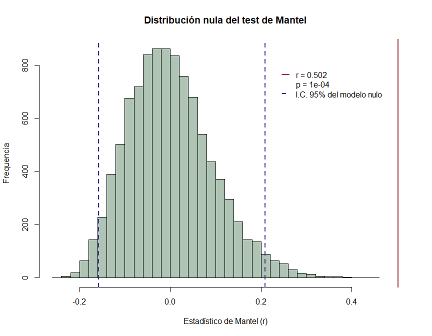
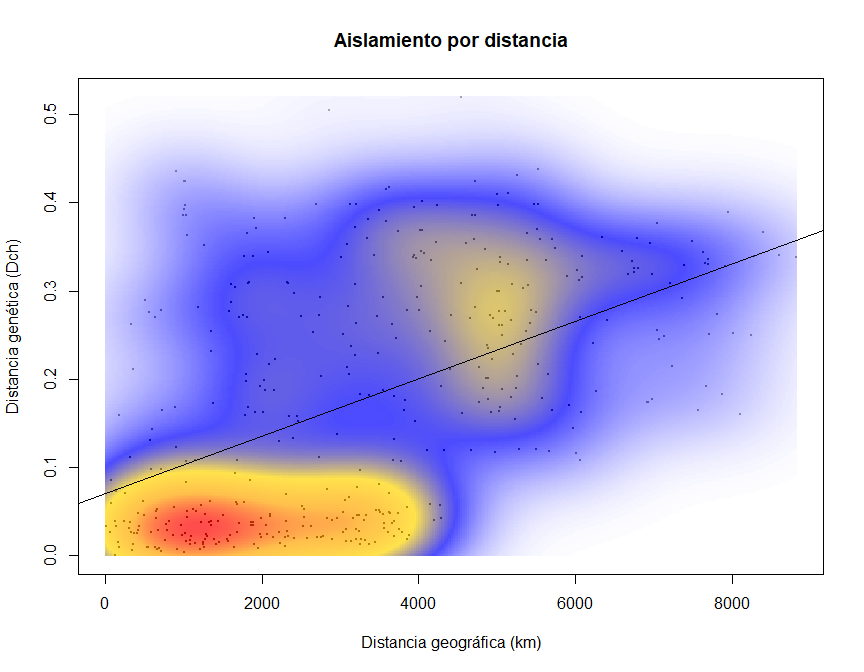

Proyecto Final: Aislamiento por distancia en poblaciones del Chorlo
Nevado (*Charadrius nivosus*)
================

<br> De: Abner Herrera<br> Para: Pavel García

D’Urban Jackson et al (2020) realizó un estudio en poblaciones del
Chorlo Nevado (*C. nivosus*) para establecer las unidades de
conservación de esta especie. En este estudio se puso a prueba la
hipótesis de presencia de estructura genética en la especie utilizando
diferentes marcadores genéticos: ADN mitocondrial (mtDNA),
microsatelites, ligados al sexo (z) y autosómicos (single nucleotide
polymorphisms - SNPs). Como parte del análisis también se evaluó si
existe aislamiento reproductivo por distancia dada la amplia
distribución de esta especie: desde el Norte de América, en Estados
Unidos, hasta el Sur de América en Perú, y también en el Caribe (D’Urban
Jackson et al, 2020).

En este proyecto se comprueba esta última hipótesis. *¿Existe
aislamiento reproductivo por distancia en las poblaciones de C.
nivosus?* Utiliando únicamente ADN mitocondrial, porque solo esos datos
están disponibles desde la fuente del artículo
(<https://static-content.springer.com/esm/art%3A10.1007%2Fs10592-020-01256-8/MediaObjects/10592_2020_1256_MOESM1_ESM.docx>),
se encontró que si existe correlación entre la distancia genéticas y las
distancia geográfica, con un valor de r = 0.502 (prueba de Mantel) y p
\< 0.05.

En el cuadro 1 se presenta las distancias un fragmento de las genéticas
calculadas por el método Dch (son 30 comparaciones en total),
“Cavalli-Sforza and Edwards Chord distance” (Fórmula 1). “Es la
distancia usaba por defecto en el paquete hierfstat, dado que Takezaki &
Nei (1996) encontraron que es la mejor para mostrar la relación entre
muestras” (Goudet et al, 2022).

Como parte del procedimiento, el archivo FASTA utilizado aquí ya
contiene las secuencias alineadas. Este paso se realizó en el software
MEGA12.

Cuadro 1. Fragmento de la matriz de distancias genéticas.

``` r
library("hierfstat") # Para calcular la matriz de distancias genéticas, Dch
library("adegenet") # Para importar las secuencias genéticas del archivo FASTA alineado
```

    ## Cargando paquete requerido: ade4

    ## 
    ##    /// adegenet 2.1.11 is loaded ////////////
    ## 
    ##    > overview: '?adegenet'
    ##    > tutorials/doc/questions: 'adegenetWeb()' 
    ##    > bug reports/feature requests: adegenetIssues()

    ## 
    ## Adjuntando el paquete: 'adegenet'

    ## The following objects are masked from 'package:hierfstat':
    ## 
    ##     Hs, read.fstat

``` r
library("vegan") # Para hacer el test de mantel
```

    ## Cargando paquete requerido: permute

    ## Cargando paquete requerido: lattice

``` r
library("geosphere") # Para calcular la matriz de distancias geográficas
library("MASS") # Para agregar la densidad de puntos en el gráfico de dispersión

# Se carga el archivo fasta con las 166 secuencias alineadas
seq = fasta2DNAbin('./mtDNA_aligned.fas')
```

    ## 
    ##  Converting FASTA alignment into a DNAbin object... 
    ## 
    ## 
    ##  Finding the size of a single genome... 
    ## 
    ## 
    ##  genome size is: 705 nucleotides 
    ## 
    ## ( 2  lines per genome )
    ## 
    ##  Importing sequences... 
    ## ..........................................................................................................................................................................................................................................................................................................................................................................................................................................................................................................................................................................................................................................................................................................................................................................................................................................................................................................................................................................................................................................................................................................................................................................................................................................................................................................................................................................................................................................................................................................................................................................................
    ##  Forming final object... 
    ## 
    ## ...done.

``` r
obj = DNAbin2genind(seq) # Se almacena en un objeto genind propio del paquete adegenet.

# Se carga la información geográfica y el nombre de los sitios muestreados. Se asume que cada coordenada corresponde a una subpoblación. 
meta <- read.table('./meta.csv', sep=',', header = T)

# Se agrega al objeto genind, pero no supe cómo trabajar las coordenadas dentro de este objeto para obtener las distancias geográficas.
obj$pop = as.factor(meta[match(rownames(obj$tab), meta$Genbank_accession),]$Site)

# Se convierte el objeto genind al objeto hierfstat para calcular el Fst.
obj.hf = genind2hierfstat(obj)

# Se calcula la matriz de distancias genéticas por el métdodo “Dch”: Cavalli-Sforza and Edwards Chord distance. This distance is used as default since Takezaki & Nei (1996) found that it was the best to retrieve the relation among samples.
# Como se trata de información genética mitocondrial, el atributo diploid se cambia a Falso, para trabajar con datos haploides.
# El método Dch se utiliza para más comúnmente para organismos haploides.
gen_dist <- genet.dist(obj.hf, method='Dch', diploid=F)
round(as.dist(as.matrix(gen_dist)[1:6, 1:6]), 7) # mostrar una pequeña parte de la matriz (es de 30x30)
```

    ##                    Arequipa_Peru   Bermuda Big_Lagoon_Florida California_east
    ## Bermuda                0.3580986                                             
    ## Big_Lagoon_Florida     0.3978874 0.1871978                                   
    ## California_east        0.3436393 0.2132781          0.0421210                
    ## Cayo_Costa_Florida     0.4095412 0.1975568          0.0095621       0.0516831
    ## Colorado               0.3540800 0.2290479          0.0601244       0.0236328
    ##                    Cayo_Costa_Florida
    ## Bermuda                              
    ## Big_Lagoon_Florida                   
    ## California_east                      
    ## Cayo_Costa_Florida                   
    ## Colorado                    0.0696866

En el cuadro 2 también se presenta una porción de la matriz de
distancias geográficas entre los 30 sitios de muestreo. La distancia se
expresa en km dadas las grandes distancias entre los puntos donde se han
colectado las muestras.

Cuadro 2. Fragmento de la matriz de distancias geográficas

``` r
# Calculo de la matriz de distancias geográficas.
# Se obtienen todos los sitios únicos (subpoblaciones) y se ordenan alfabéticamente, al igual que aparecen en la matriz de distancias genéticas.
sites <- unique(meta[, c("Site", "Lat", "Long")])
sites <- sites[order(sites$Site), ] # Este paso es CRÍTICO, dado que la correlación de Mantel revisa las posiciones de la matriz, asumiendo que tienen el mismo orden.

# Se obtiene la matriz de distancias en m.
geo_dist <- distm(sites[, c("Long", "Lat")], fun = distHaversine)
geo_dist <- geo_dist / 1000 # Se convierte a km.

# Cambia los nombres de filas y columnas de la matriz de distancias.
rownames(geo_dist) <- sites$Site
colnames(geo_dist) <- sites$Site

# Se convierte a una matriz que contiene los datos únicamente en la parte triangular de abajo, que es la que se usa en la prueba de Mantel.
geo_dist <- as.dist(geo_dist)
round(as.dist(as.matrix(geo_dist)[1:6, 1:6]), 7) # mostrar una pequeña parte de la matriz (es de 30x30)
```

    ##                    Arequipa_Peru   Bermuda Big_Lagoon_Florida California_east
    ## Bermuda                5550.6726                                             
    ## Big_Lagoon_Florida     5525.7575 2160.1742                                   
    ## California_east        7634.4340 4772.5184          2840.4967                
    ## Cayo_Costa_Florida     4999.2817 1804.8226           640.0838       3462.7356
    ## Colorado               6957.1443 3487.1678          1668.3818       1287.1341
    ##                    Cayo_Costa_Florida
    ## Bermuda                              
    ## Big_Lagoon_Florida                   
    ## California_east                      
    ## Cayo_Costa_Florida                   
    ## Colorado                    2308.4416

``` r
# Test de Mantel
mantel_test <- mantel(gen_dist, geo_dist, method = "pearson", permutations = 9999)
#mantel_test

# Histograma de los resultados de Mantel
# Extrae las permunaciones para graficar la distribución
null_distribution <- mantel_test$perm
#null_distribution

# Gráfico con el valor calculado, las permutaciones y el IC de 95%
hist(null_distribution, 
     breaks = 30, 
     col = "#afc4b4", 
     main = "Distribución nula del test de Mantel",
     xlab = "Estadístico de Mantel (r)",
     ylab = "Frequencia",
     xlim = range(c(null_distribution, mantel_test$statistic)))

abline(v = mantel_test$statistic, col = "#9c2c33", lwd = 2) # r calculado

quantiles <- quantile(null_distribution, probs = c(0.025, 0.975)) # IC 95%
abline(v = quantiles, col = "#362d96", lwd = 2, lty = 2)

legend(x = 0.23, y = 800, 
       legend = c(paste0("r = ", round(mantel_test$statistic, 3)), paste0("p = ", mantel_test$signif), "I.C. 95% del modelo nulo"), 
       col = c("#9c2c33", NA, "#362d96"),  
       lwd = c(2, NA, 2),
       lty = c(1, NA, 2),
       seg.len = 1,
       bty = "n")
```

<!-- -->
Figura 1. Histograma de la distribución nula del test de Mantel y el
valor r calculado.

La figura 1 demuestra que existe una correlación positiva entre las
distancias geográficas y genéticas, aunque débil (r = 0.502). Esto
demuestra el aislamiento reproductivo por distancia.

El test de Mantel se realizó con 9999 permutaciones, replicando el
número de permutaciones del artículo original.

``` r
# Gráfico de dispersión de la distancia geográfica y distancia genética

# Calcula la densidad de puntos dentro del gráfico, permite saber donde está concentrado la mayoría de nuestros datos.
dens <- kde2d(as.vector(geo_dist), as.vector(gen_dist), n=300) 

# Asigna diferentes colores para distinguir las densidades, de blanco a rojo que equivale de menor a mayor densidad.
myPal <- colorRampPalette(c("white", "blue", "gold", "orange", "red")) 
plot(geo_dist, gen_dist, pch=20,cex=.5,
     xlab = "Distancia geográfica (km)",
     ylab = "Distancia genética (Dch)")
image(dens, col=transp(myPal(300),.7), add=TRUE)
title("Aislamiento por distancia")

# Regresión lineal entre las distancias geográficas y genéticas.
modelo <- lm(as.vector(gen_dist) ~ as.vector(geo_dist))
abline(modelo)
```

<!-- --> Figura
2. Gráfico de dispersión entre la distancia geográfica y genética de las
poblaciones observadas.

Del color blanco al rojo se representa de menor a mayor la densidad de
dispersión de las poblaciones. Las zonas más densas están cercanas al
modelo lineal que se ha ajustado a esta correlación entre ambas
distancias.

## Referencias:

D’Urban Jackson, J., Bruford, M.W., Székely, T. et al. Population
differentiation and historical demography of the threatened snowy plover
*Charadrius nivosus* (Cassin, 1858). *Conserv Genet 21*, 387–404 (2020).
<https://doi.org/10.1007/s10592-020-01256-8>

Goudet, J., Jombart, T., Kamvar, Z. N., Archer, E. & Hardy, O. (2022).
*Estimation and Tests of Hierarchical F-Statistics: Package
‘hierfstat’*.
<https://cran.r-project.org/web/packages/hierfstat/hierfstat.pdf>.

Takezaki, N. & Nei, M. (1996). *Genetic distances and reconstruction of
Phylogenetic trees from microsatellite DNA*. Genetics 144:389-399
